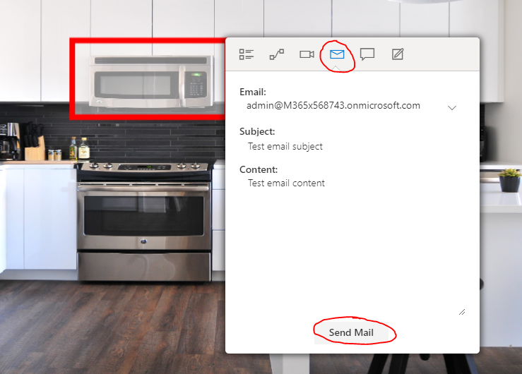
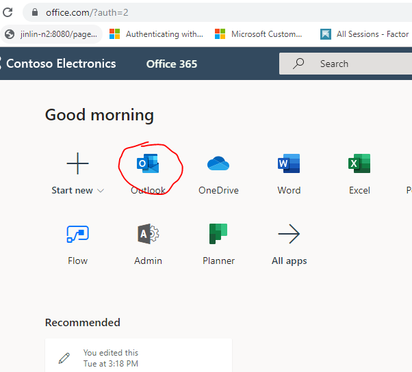
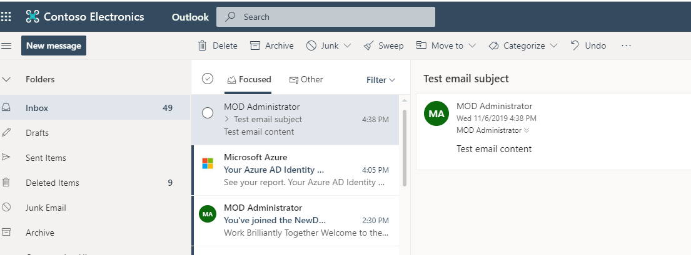

# Module 1 - Send an email 
In this module you will learn the send email graph api  

#### This module is based on the Teams workshop, please use the same code base

## Send an email
1. Read the [document](https://docs.microsoft.com/en-us/graph/api/user-sendmail?view=graph-rest-1.0&tabs=http) for how to send an email
2. Implement the **SendMail** function in **Scripts/index.js**
3. Select an object in the image, and click the **Send Mail** button in the pop-up menu  
  
4. Login the [Office portal](https://www.office.com/) with the same admin account, and check outlook, you should be able to see the mail in inbox  
  
  

