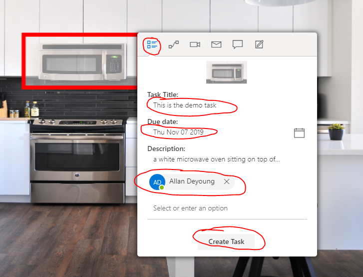
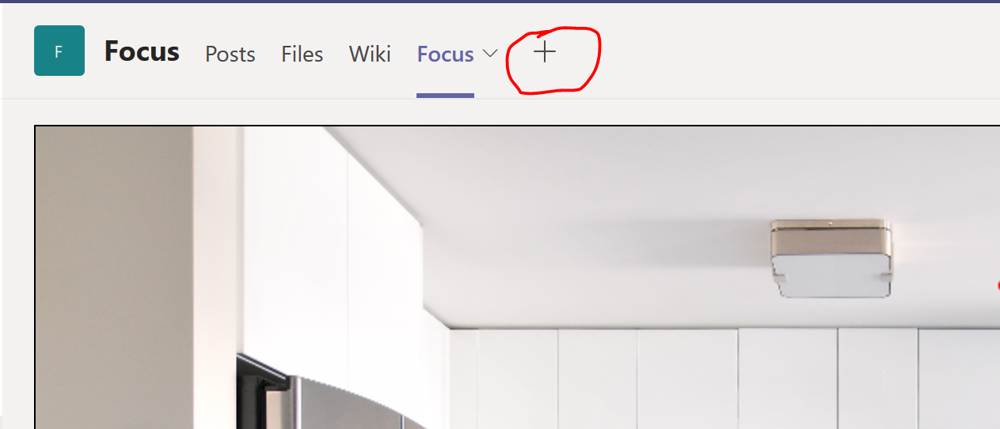
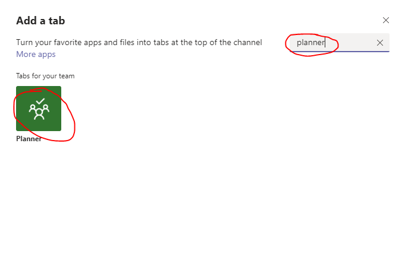
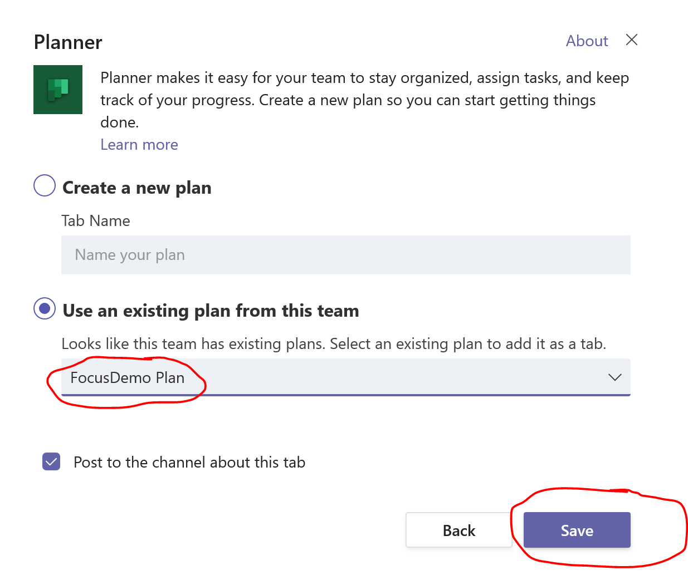
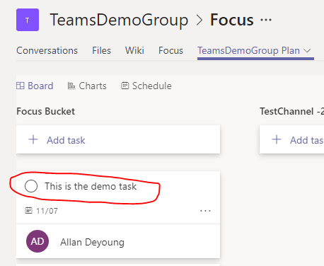

# Module 2 - Create Planner task
In this module you will learn the create Planner task graph api  

#### This module is based on the Teams workshop, please use the same code base

## Creat a Planner task
1. Read the [document](https://docs.microsoft.com/en-us/graph/api/planner-post-tasks?view=graph-rest-1.0&tabs=http) for how to create a task  
2. Implement the **createTask** function in **Scripts/Planner/planner.js**  
3. Select a object in the image, and perform the **Create Task** operation in the pop-up menu  
 - Please make sure **Task Title**, **Due Date** and **People** fields are not empty  
  

4. Add the Planner tab into the channel, and check the created task  
  
  
  
  

