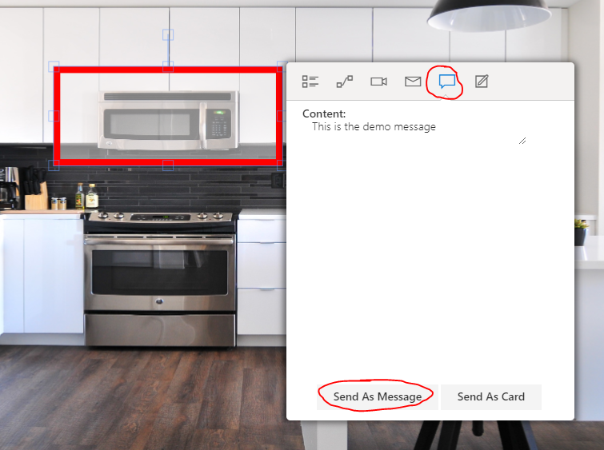
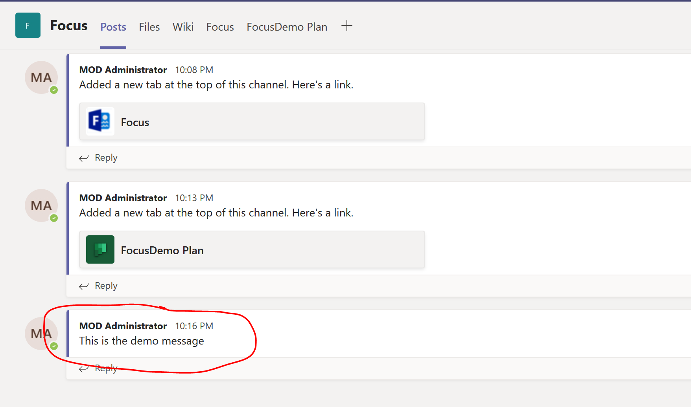
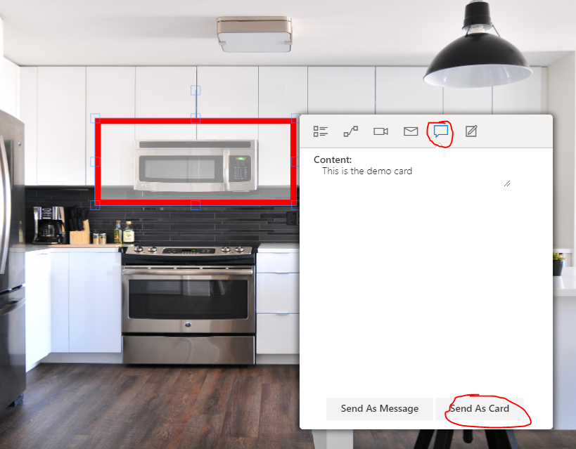
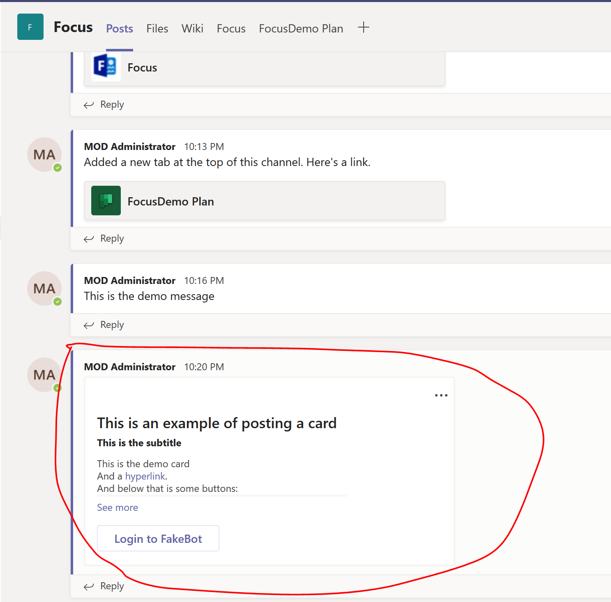

# Module 3 - Advanced: Post Teams Message/Card 
In this module you will post message/card into the Teams channel 

## Post Teams message
1. Read the [document](https://docs.microsoft.com/en-us/graph/api/channel-post-message?view=graph-rest-1.0&tabs=http) for how to post a message into teams channel
2. Implement the **SendMessage** function in **Scripts/teamsapp.js**
3. Select an object in the image, and click the **Send As Message** button in the pop-up menu, you will see the posted message if your code is correct

## Post Teams card
1. Read the [document](https://docs.microsoft.com/en-us/graph/api/channel-post-messages?view=graph-rest-beta&tabs=http) for how to post a card into teams channel
2. Implement the **SendCard** function in **Scripts/teamsapp.js**
3. Select a object in the image, and click the **Send As Card** button in the pop-up menu, you will see the posted card if your code is correct

