# Module 3 - Focus back-end
In this module you learn how to register back-end application and call graph apis from c#  

## Register the app in Azure for Focus back-end
1. Login into the [Azure portal](https://ms.portal.azure.com) with admin account  
2. Register Focus back-end App  

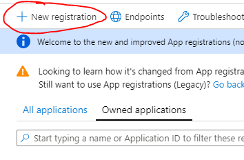  

- Please select the multitenant option  
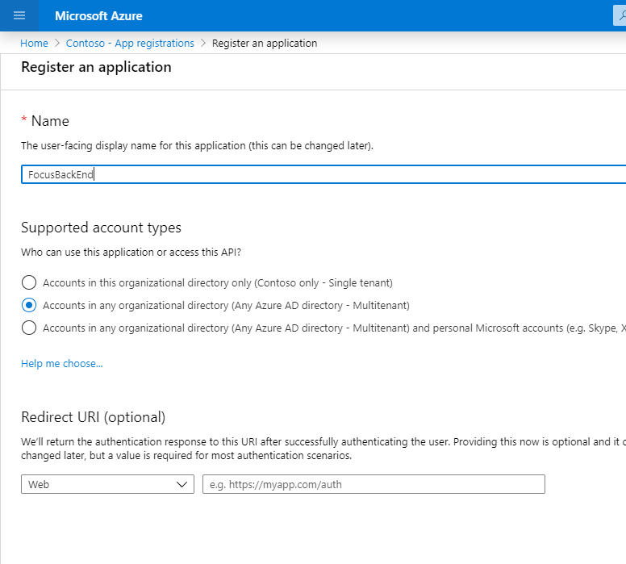  

3. Add the **Application permissions** for this app, make sure to select all required permissions, you will have to **search those permissions one by one and check them**  

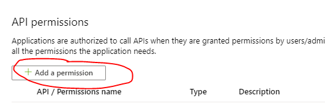
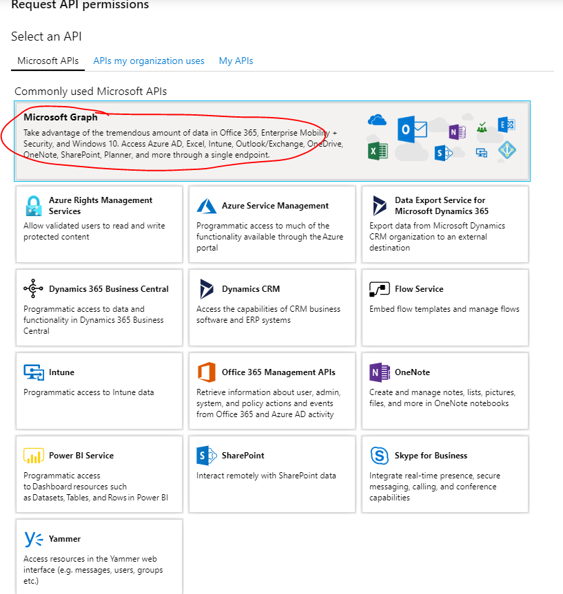
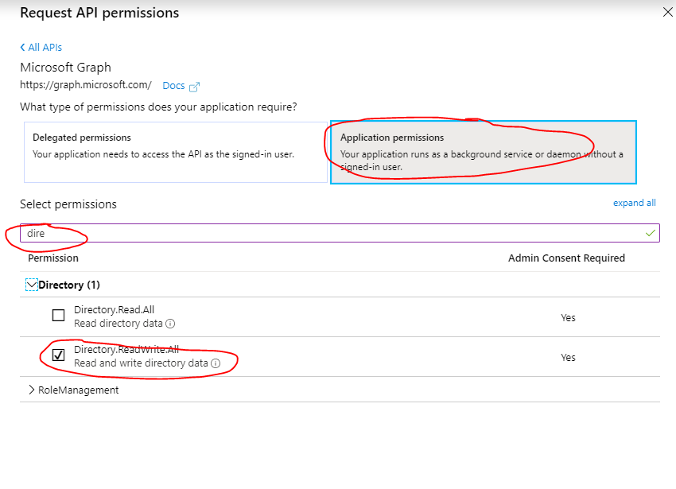  
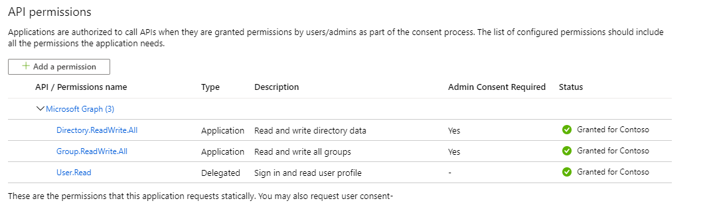    

4. Grant the admin consent  
  

5. Generate the app secret, and make sure you **copy the generated secret somewhere**, you will need it in step 6
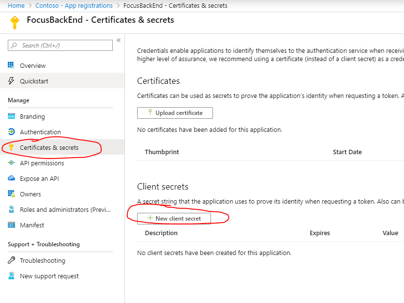  
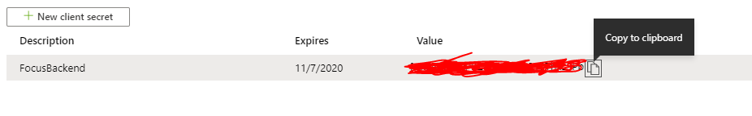  

6. Open the **TeamsAutoChannel** solution in **workshop-code-base/TeamsAutoChannel**, update **AppTenantId**, **AppClientId**, **AppClientSecret**, **DemoGroupMailAddress** values inside **app.config** file
 - For **AppTenantId** and **AppClientId**, you can find them inside registered azure app  
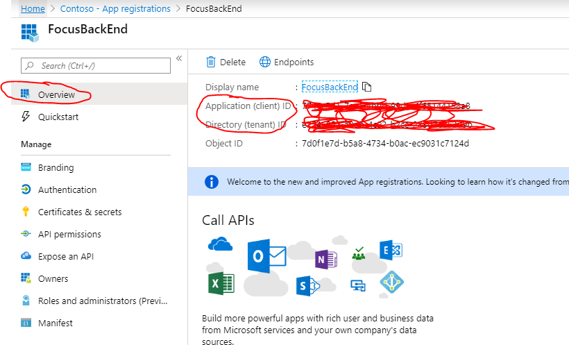  
 - For the **DemoGroupMailAddress**, find the group email you register in [M365 admin center](https://admin.microsoft.com/adminportal/home#/groups)  
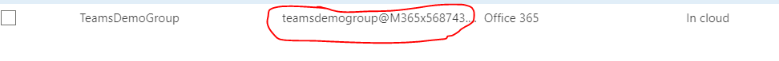  

7. Implement Graph functions in c#
 - Complete **GetDemoGroupId** function inside **Graph/GroupHelper.cs** file  
 - Complete **CreateChannelAsync** function and **AddCustomTabAsync** function inside **Graph/TeamsHelper.cs** file
 
8. Run the solution, you will be able to see new channel got created and the **Focus** tab got added if the code implementation is right
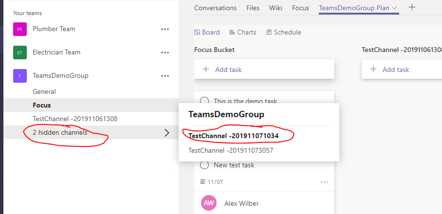  
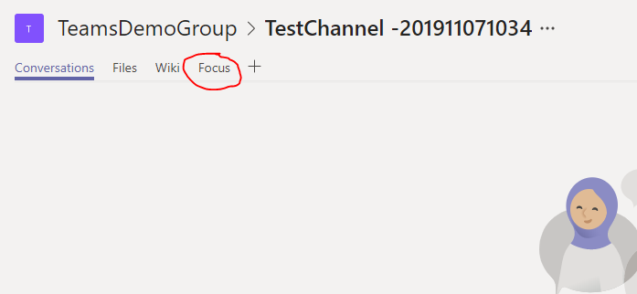 

 

 
 
 
