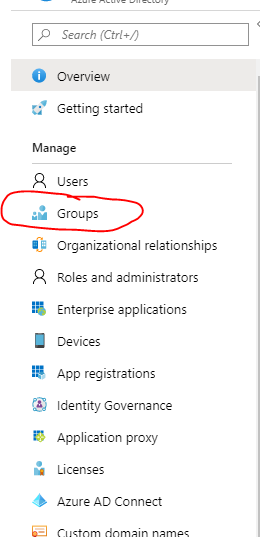
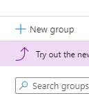
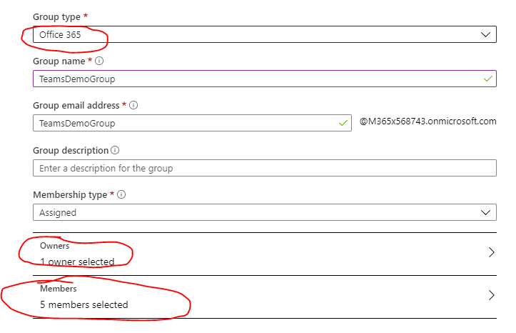

# Module 1 - Set up Teams
In this module you will set up the Teams environment for workshop and learn basic knowledge of Teams Group and Channel

## Set up group in Azure portal
1. Login into the [Azure portal](https://ms.portal.azure.com) with admin account
2. Creat a Office 365 group, add 5 members, and make the admin as the owner of the group

## Create a Teams team
1. Login into [Microsoft Teams](https://teams.microsoft.com)
2. Create a team from the previous Office 365 group

## Create a Teams channel
1. Create a Teams channel for the Focus app 

