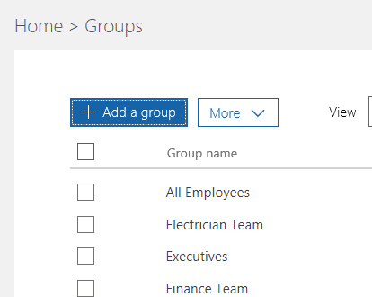
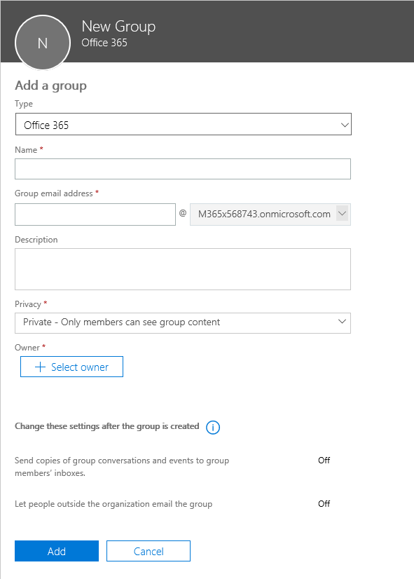
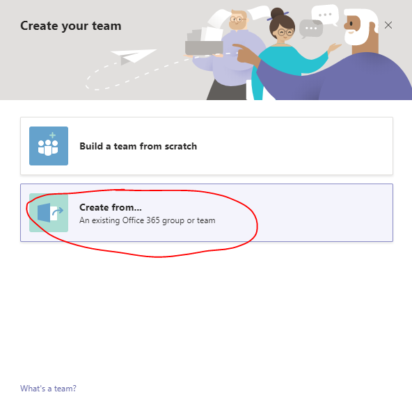
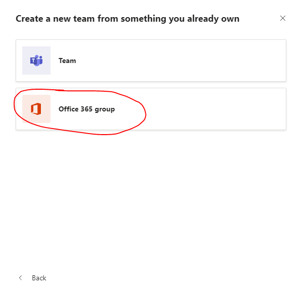
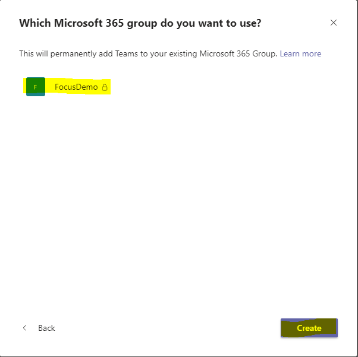
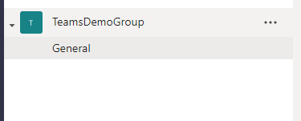
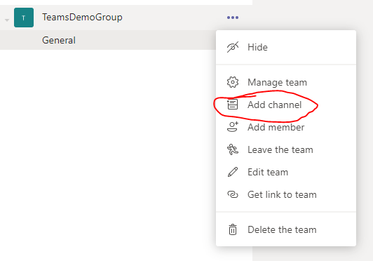
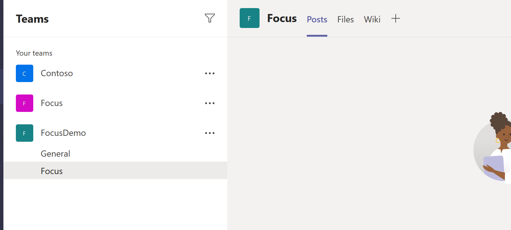
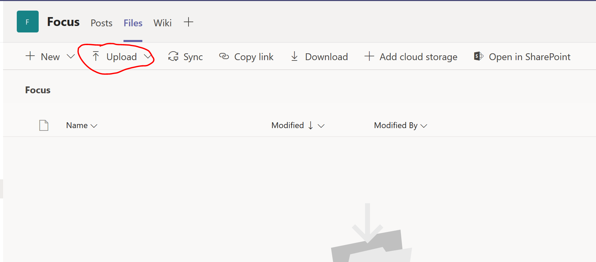

# Module 1 - Set up Teams  
In this module you will set up the Teams environment for workshop and learn basic knowledge of Teams Group and Channel  

## Set up group in M365 admin center 
1. Login into the [M365 admin center](https://admin.microsoft.com/adminportal/home#/groups) with admin account  
2. Create a private Office 365 group, add 5 members, and make the admin as the owner and member of the group  

## Create a Teams team  
1. Login into [Microsoft Teams](https://teams.microsoft.com), please select the web app option for debugging  
2. Create a team from the previous Office 365 group  

## Create a Teams channel  
1. Create a Teams channel for the Focus app  

  
2. Upload the Focus.jpg(exercises/Teams/Focus.jpg) into the channel files

