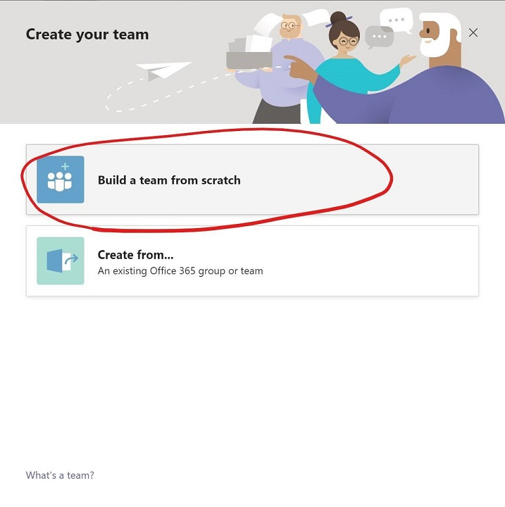
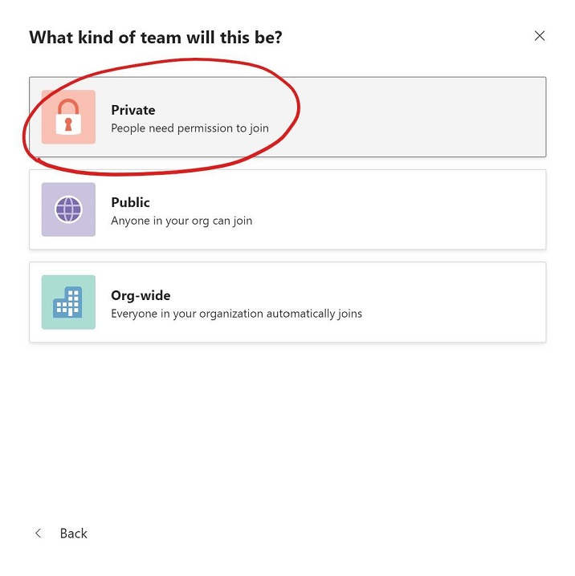
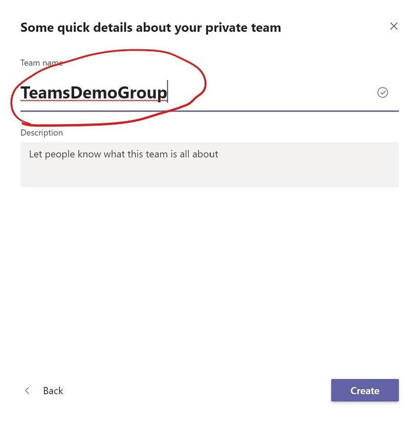
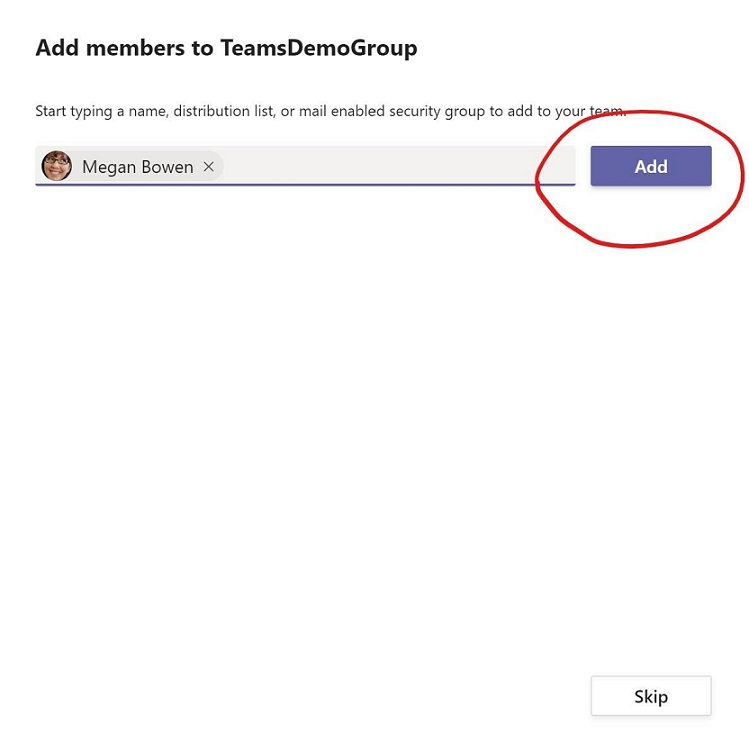

# Module 1 - Set up Teams  
In this module you will set up the Teams environment for workshop and learn basic knowledge of Teams Group and Channel  

## Create team in Microsoft teams 
1. Login into [Microsoft Teams](https://teams.microsoft.com) with admin account
2. Create a team, and add 5 members  

## Create a Teams channel  
1. Create a Teams channel for the Focus app  

  
2. Upload the Focus.jpg(exercises/Teams/Focus.jpg) into the channel files

