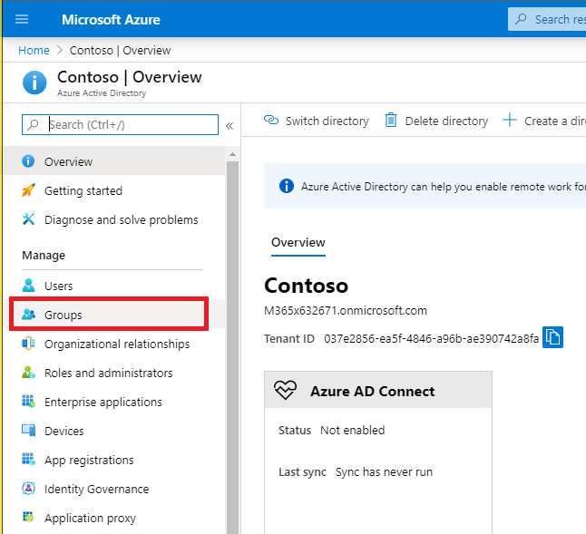
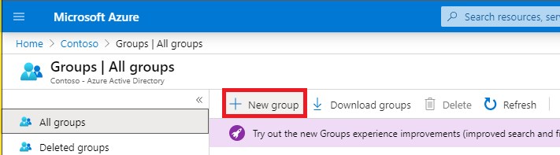
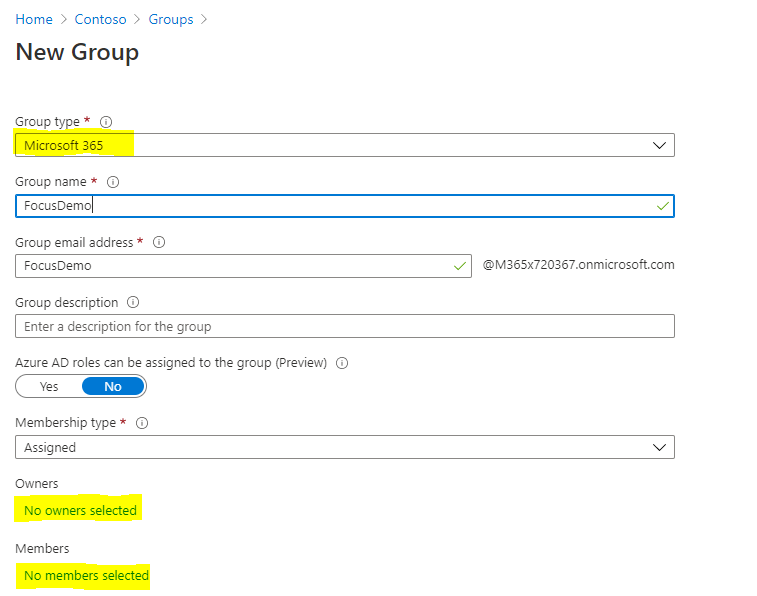

# Module 1 - Set up Teams  
In this module you will set up the Teams environment for workshop and learn basic knowledge of Teams Group and Channel  

## Set up group in Azure
1. Login to [Azure](https://portal.azure.com) with your admin tenant account  
2. Navigate to Azure Active Directory > Groups  
  
  
3. Create a new Office 365 group  
  
  
4. Assign your admin account as an owner and add five other Office 365 accounts as members  

## Create a Teams team  
1. Login into [Microsoft Teams](https://teams.microsoft.com), please select the web app option for debugging  
2. Create a team from the previous Office 365 group  

## Create a Teams channel  
1. Create a Teams channel for the Focus app  

  
2. Upload the Focus.jpg(exercises/Teams/Focus.jpg) into the channel files

