# Module 2 - Set up Focus App  
In this module you will set up the Focus app inside in Teams channel created at Module 1  

## Hook up ngrok with Focus app code  
1. Run the FocusFrontEnd solution in workshop-code-base folder  
2. Download the [ngrok software](https://ngrok.com/download) if you haven't  
3. Start ngrok to create an externally addressable URL for the Focus app:  
 - Run the ngrok.exe through command line, for example:  
 - ngrok http **60792** --host-header=localhost:**60792**  
 - Replace the port number as needed.  
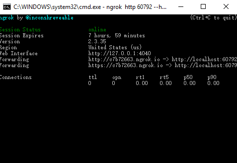  

## Register the Focus App in Azure  
1. Login into the [Azure portal](https://ms.portal.azure.com) with admin account  
2. Register Focus App  
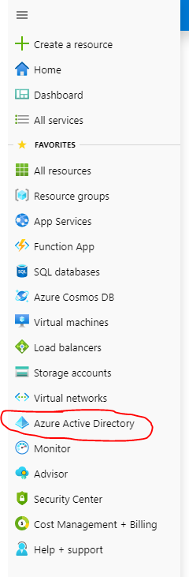
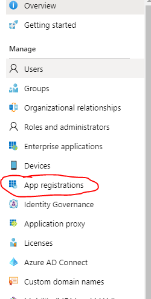
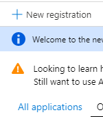  

 - Please select the multitenant option and add the redirect url **https://****.ngrok.io/WorkFlow/EndAuth**, replace those stars with the real nogrok url generated at last step  

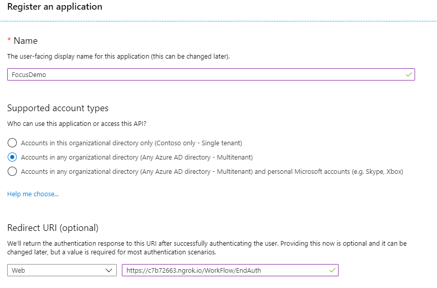

3. Add the API permissions for this app
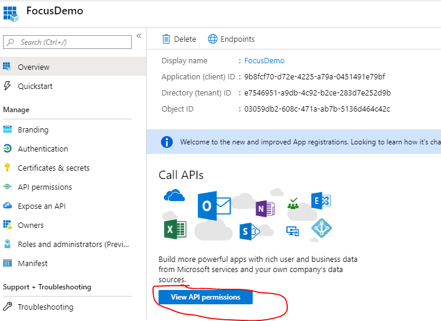
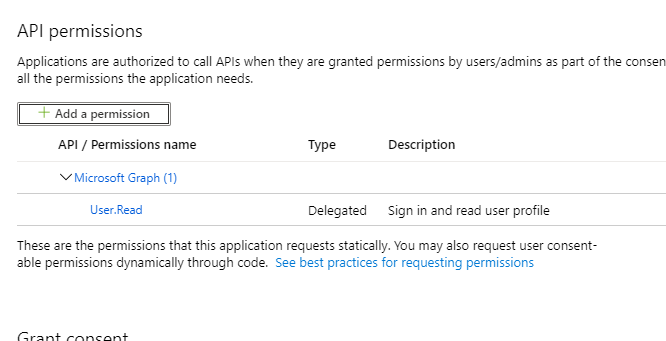

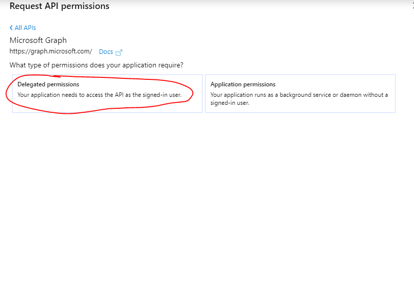  

 - Make sure to select all belong permissions, you will have to **search those permissions one by one and check them**
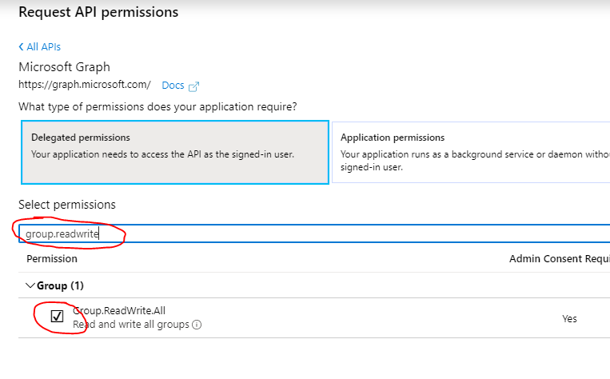  
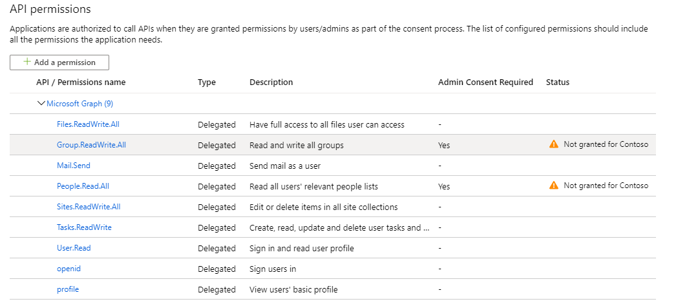  

 - Grant the admin consent  
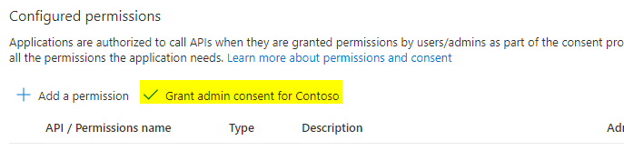  

4. Implicit grant token  
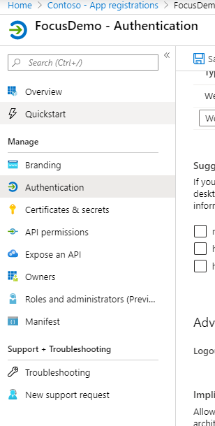  
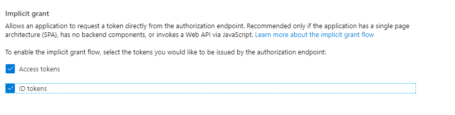  

## Install Focus App to Teams channel
1. Update the content of **scripts/config.js**, replace the g_appId with client id got from last step  
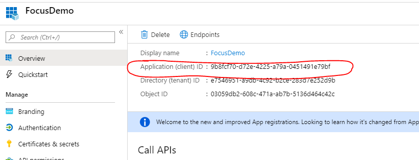  

2. Update the content of **Manifest/manifest.json**, update "**configurationUrl**","**contentUrl**","**websiteUrl**","**validDomains**" with the ngrok url  
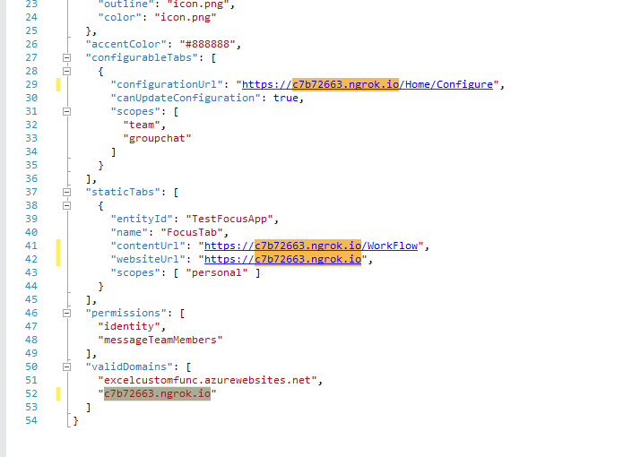  

3. Zip **Manifest/icon.jpg** and **Manifest/manifest.json**
  
4. Upload the app zip to Teams  
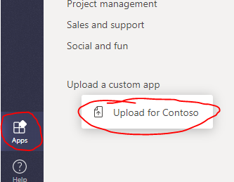  
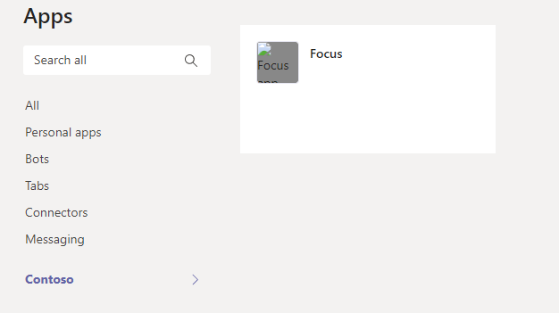  

5. Add the Focus app into channel  
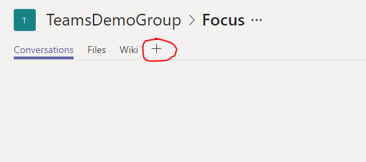
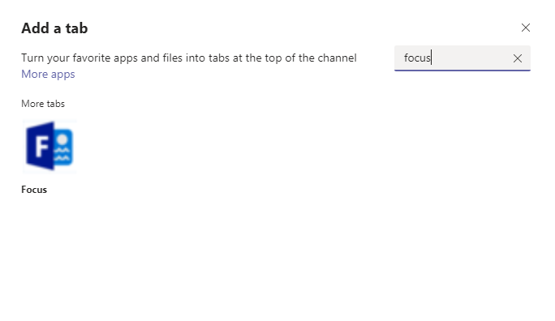
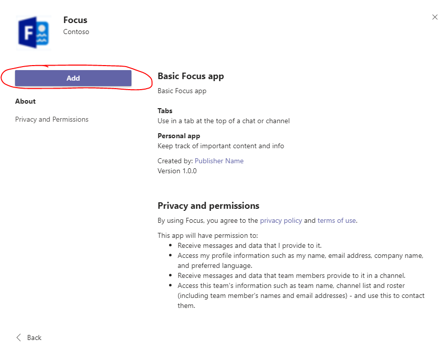

6. You should be able to see the focus app now  
 - Please **unblock** the pop up window or the authentication process will be blocked  
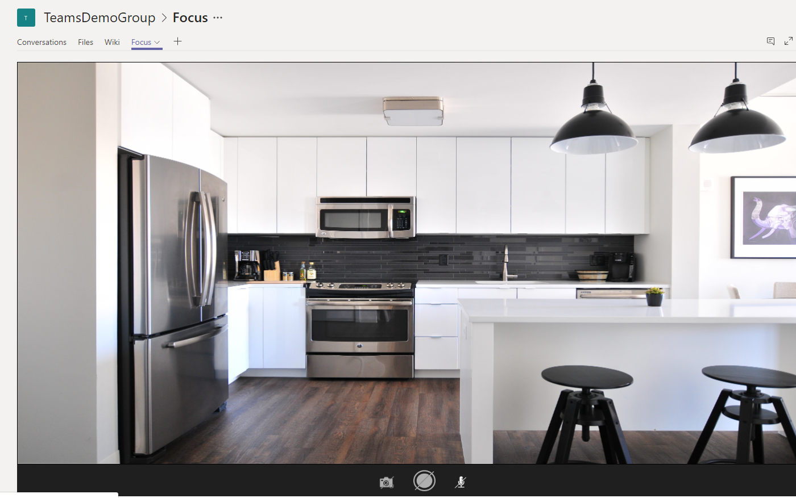
